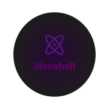

  

# Minishell
## Grade: 125/100
Minishell is a project where we have to create a simple shell in C, it is the first project where we had to work in a team, it was a challenging project that we have learned a lot from.  
Here is what we learned in minishell:
* Pipes: redirecting output of a command to another
* Programming inbuilt commands: env, export, unset, echo, pwd
* Signals: How to handle signals correctly in the parent and child process
* String tokenization: How to break a string into smaller parts using delimiters
* Lexical analysis: How to categorize tokens based on their context
* Multiprocessing: How to duplicate a process and handle it correctly
* Subshells: Duplicating the main shell to execute parts of the prompt recursively
* Controlling the terminal: Learned how to use terminal capabilites for cleaner output and modifying terminal attributes to control the terminal behaviour correctly.
* Redirections: Redirecting the I/O of a command
* AND/OR (Short circuiting): Control which operations should execute based on the last exit code
* Heredoc: Receiving input from user then redirecting it instead of a file
* Wildcards: Implemented search for pattern when using `*`
* Expander: Expanded the enviroment variable with its data in tokens
## Resources:
Bash Manual: https://www.gnu.org/software/bash/manual/bash.html  
Readline Documentation: https://tiswww.case.edu/php/chet/readline/rltop.html#Documentation  
Curses Library: https://en.wikipedia.org/wiki/Curses_(programming_library)  
String Tokenization in C: https://www.geeksforgeeks.org/string-tokenization-in-c/  
Introduction of Lexical Analysis: https://www.geeksforgeeks.org/introduction-of-lexical-analysis/  
Bash Command-line Processing: https://www.linux.org/threads/bash-03-%E2%80%93-command-line-processing.38676/  
Termcap Manual: https://www.gnu.org/software/termutils/manual/termcap-1.3/html_node/termcap_toc.html
